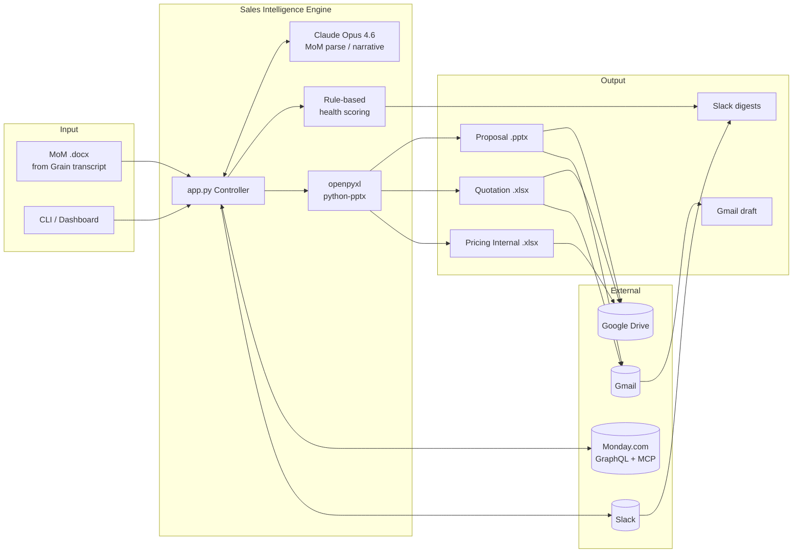

# Sales Intelligence Engine

Automate the entire post-meeting sales workflow — MoM parsing, CRM update, proposal/quotation/pricing generation, Drive upload, Gmail draft, pipeline health scoring, and Slack reporting — in a single ~60 second command.

Built for the **PTP Hackathon 2026** by Sembuh AI.

---

## The Problem

After every client meeting, a B2B Account Manager spends 2–3 hours doing glue work — updating the CRM, drafting a tailored proposal and quotation, building an internal pricing sheet, sending a review email, posting a Slack update. Across 10 active deals on weekly cadence, that's half the work week spent *reporting on* sales instead of selling. Each manual hop introduces drift: proposals become inconsistent, CRM fields go stale, pricing math varies per deal, and deals silently go cold in "Waiting Confirmation" because nobody is watching pipeline health.

## The Solution

A single command — `python app.py pipeline --deal "X"` — runs the full post-meeting chain end-to-end:

```
MoM (.docx)  →  Monday.com CRM update  →  fetch refreshed deal
                                                    │
                                ┌───────────────────┼───────────────────┐
                                ▼                   ▼                   ▼
                        Proposal .pptx     Quotation .xlsx     Pricing Internal .xlsx
                                │                   │                   │
                                └───────────────────┼───────────────────┘
                                                    ▼
                                         Google Drive folder
                                                    ▼
                                           Gmail draft (internal review)
                                                    ▼
                                       Deal health scoring (0–100)
                                                    ▼
                              Slack reports (managerial + per-AM + critical alerts)
```

Two-layer architecture keeps the pipeline safe:

- **Claude (Opus 4.6)** handles unstructured judgment — parsing MoMs, writing narratives, updating CRM via MCP.
- **Deterministic Python** handles pricing math, template filling (openpyxl / python-pptx), and rule-based health scoring.

---

## Architecture



---

## Features

- **MoM → CRM automation** — Claude extracts fields from free-form `.docx` minutes and updates Monday.com via MCP, including a meeting-summary comment.
- **Three branded document generators** — Quotation (`.xlsx`), Internal Pricing (`.xlsx`, 4 sheets), Proposal (`.pptx`), all filled from `PTP Hackathon - Brief/` templates.
- **Google Drive upload** — organized per-client folder tree: `/Client/{Proposals, Quotations, Pricing}/`.
- **Gmail draft** — internal-review email with proposal + quotation attached, subject prefilled, body auto-generated.
- **Pipeline health scoring** — deterministic 0–100 score per deal with explicit reason codes (no owner / past close date / stage-without-proposal / etc.).
- **Four Slack report types** (per hackathon spec):
  - Weekly managerial digest with weighted forecast + health distribution
  - Per-AM daily briefing filtered by owner
  - Critical-deal real-time alert (score < 50)
  - Deal activity update when MoM is processed
- **Interactive dashboard** — served locally at `http://127.0.0.1:8765/` with KPI cards, deal health table, pipeline bars, revenue charts, AI-recommended actions, and per-deal action buttons with live SSE log streaming.
- **CLI-first, scriptable** — every action is a subcommand of `app.py` and suitable for cron / CI / email-trigger integration.

---

## Prerequisites

- Python **3.10+** (tested on 3.14)
- `npx` on PATH (used to launch Monday.com MCP server: `verdant-monday-mcp`)
- API credentials for: Monday.com, Google (service account with DWD or OAuth token), Slack bot token, Anthropic API key
- Google Cloud project with Gmail + Drive APIs enabled

---

## Setup

```bash
# Clone and enter
git clone <repo-url> sales-intelligence
cd sales-intelligence

# Create venv and install deps
python3 -m venv .venv
source .venv/bin/activate
pip install -r requirements.txt

# Configure environment
cp .env.example .env   # then edit .env with your credentials
```

### Environment variables (`.env`)

```
# Anthropic
ANTHROPIC_API_KEY=sk-ant-...
CLAUDE_MODEL=claude-opus-4-6                  # optional override

# Monday.com
MONDAY_API_KEY=eyJhbGciOi...
MONDAY_WORKSPACE_NAME=Your Workspace
MONDAY_WORKSPACE_ID=1234567

# Slack
SLACK_BOT_TOKEN=xoxb-...
SLACK_TEAM_ID=T086...
SLACK_CHANNEL_ID=C0AU...

# Google
GOOGLE_IMPERSONATE_EMAIL=you@yourdomain.com   # service-account impersonation
FOLDER_ID=1TsIPta3R...                        # Drive parent folder ID
```

### Google authentication

Two options (in priority order):

1. **OAuth user token** — run `python setup_google.py` with a `credentials.json` from Google Cloud Console (OAuth Client ID, Desktop app); writes `token.json`.
2. **Service account with domain-wide delegation** — drop the SA JSON at `service_account/<project-id>.json` and set `GOOGLE_IMPERSONATE_EMAIL`.

---

## Usage

### One-shot pipeline (recommended)

```bash
# Default MoM (PTP Hackathon - Brief/MoM-Sentosa-Health-PoC-Review.docx), all deals
python app.py pipeline

# Filter to a specific deal (substring match)
python app.py pipeline --deal "Sentosa"

# Use a custom MoM file
python app.py pipeline --mom /path/to/minutes.docx --deal "Sentosa"
```

### Individual steps

```bash
# Just update CRM from MoM (no doc generation, no Slack)
python app.py mom /path/to/minutes.docx
python app.py mom --dry-run             # preview extraction only

# Just generate documents from current Monday state
python app.py generate
python app.py generate --deal "Sentosa"

# Just run health scoring + Slack alerts
python app.py health

# Interactive Monday.com assistant (Claude + MCP)
python app.py interactive
```

### Dashboard

```bash
# Static HTML export
python app.py dashboard                     # writes output/dashboard.html
python app.py dashboard --deal "Sentosa"
python app.py dashboard --open              # open in browser

# Interactive server (with per-deal action buttons + live logs)
python app.py dashboard --serve             # http://127.0.0.1:8765/
python app.py dashboard --serve --open
python app.py dashboard --serve --port 9000
```

---

## Project structure

```
sales-intelligence/
├── app.py                          # main CLI — all subcommands
├── dashboard.py                    # HTML dashboard renderer
├── google_tools.py                 # Gmail + Drive API wrappers
├── generate_docs.py                # (legacy) standalone doc generator
├── monday.py                       # (legacy) standalone MoM updater
├── requirements.txt
├── .env                            # credentials (gitignored)
├── service_account/
│   └── *.json                      # Google SA key
├── PTP Hackathon - Brief/          # templates + specs + sample MoM
│   ├── Sembuh AI_Quotation Template.xlsx
│   ├── Hackathon_Pricing Internal.xlsx
│   ├── Sembuh AI_Proposal.pptx
│   ├── MoM-Sentosa-Health-PoC-Review.docx
│   ├── Deal-Health-Dashboard-Spec.docx
│   ├── Slack-Report-Spec.docx
│   ├── deal-health-dashboard.html
│   ├── Grain-Mock-Call-Script.md.docx
│   └── Loom-Demo-Script-2min.md.docx
└── output/                         # generated artifacts (gitignored)
    └── <safe_client_name>/
        ├── Sembuh AI - <name> - Proposal v1.pptx
        ├── Sembuh AI - <name> - Quotation v1.xlsx
        └── Sembuh AI - <name> - Pricing Internal.xlsx
```

---

## How it works (step by step)

`python app.py pipeline --deal "Sentosa"` runs three sequential steps:

### Step 1 — MoM → Monday.com CRM
1. `extract_docx_text()` pulls paragraphs + tables from the `.docx`.
2. A `MondayMCPClient` spawns `npx verdant-monday-mcp` over stdio.
3. Claude (Opus 4.6) receives the MoM text with a system prompt constraining it to `workspace_ids=[<your_workspace>]`, then uses MCP tools to: list boards → find Deals board → search matching deal → update columns (`deal_stage`, `deal_value`, `deal_expected_close_date`, `deal_close_probability`) → add an MoM-summary comment.

### Step 2 — Fetch + Generate
1. Direct GraphQL (`fetch_boards` → `find_deals_board` → `fetch_deals`) pulls the refreshed deal data.
2. `parse_deal()` normalizes Monday column IDs into structured fields + synthesizes fallbacks when values are blank.
3. `detect_products(deal_name)` picks product mix from name keywords (`full suite` / `fwa` / `ocr-stp` / default all-3).
4. Three generators fire in sequence:
   - `generate_quotation()` — line items via `MARGIN_ASSUMPTIONS` × volume.
   - `generate_pricing_internal()` — 4 sheets with blended margin + pipeline roll-up.
   - `generate_proposal()` — python-pptx string replacement for client name + date.
5. Files written to `output/<safe_client_name>/`.
6. Google Drive upload creates a client folder + 3 subfolders, uploads each file into the matching subfolder.
7. Gmail draft created to `sales@sembuh.ai` with proposal + quotation attached.

### Step 3 — Health + Slack
1. `compute_health_score(deal)` assigns 0–100 with reason codes.
2. Four Slack message types posted to `$SLACK_CHANNEL_ID`:
   - Managerial digest (pipeline totals, health distribution, top-5 attention)
   - Per-AM daily briefing (one per owner)
   - Critical alert (any deal with score < 50)
   - Deal activity (only when MoM was processed and single deal matched)

---

## Design decisions

| Decision | Why |
|---|---|
| Claude via MCP for CRM updates | Natural-language prompts + auto tool discovery; no brittle GraphQL mutation writers for each MoM variant |
| Direct GraphQL for Monday reads | Claude tool-use is nondeterministic; reads need to be fast and deterministic |
| openpyxl / python-pptx for templates | Full control over output, no vendor lock-in, auditable math |
| Rule-based health scoring | Auditability — every "at risk" decision has explicit reason codes; LLM hallucination can't silently flip a score |
| Single-process job queue in dashboard | Prevents stdout-capture collisions between concurrent jobs |
| Per-client Drive folder tree | Canonical location per client, human-browsable, matches sales ops filing convention |

---

## Known limitations & gotchas

1. **MoM → CRM is partial.** The current MCP prompt only updates `deal_stage`, `deal_value`, `deal_expected_close_date`, `deal_close_probability`, plus a comment. Operational columns used by generators (`monthly_claim_vol`, `members_covered`, `incurred`, `proposal_date`) are **not** updated — so pricing math falls back to synthesized values. Fix on roadmap.
2. **`detect_products` keyword matching is fragile.** Deal name must contain `full suite` / `fwa` / `ocr` / `stp` for the right product mix, else defaults to all three. Better: add a real Monday column for products.
3. **Excel templates lose visual layout.** `_unmerge_and_clear` unmerges all merged ranges and clears cell values, so banded headers and logos in the source `.xlsx` are broken in output.
4. **No discount or tax calculation.** Quotation TOTAL is a plain sum of line items; "prices exclude taxes" is only a text disclaimer. Add subtotal / discount / tax / grand total rows if needed.
5. **Quotation number isn't persistent.** `SBH-Q-{year}-{seq}` uses the in-run index — re-running the same day reuses numbers.
6. **Dashboard actions run serially.** One job at a time (stdout redirect is process-global); second request returns HTTP 409.

---

## Tech stack

- **Python 3.10+** — core
- **Anthropic Claude Opus 4.6** — LLM (via `anthropic` SDK)
- **Model Context Protocol (`mcp`)** — Claude ↔ Monday.com
- **verdant-monday-mcp** — Monday.com MCP server (via `npx`)
- **openpyxl** — `.xlsx` template rendering
- **python-pptx** — `.pptx` template rendering
- **python-docx** — MoM extraction
- **google-api-python-client** — Gmail + Drive
- **requests** — Monday GraphQL + Slack Web API
- **Chart.js** (CDN) — dashboard charts
- **Server-Sent Events** (stdlib `http.server`) — dashboard log streaming

---

## Commands reference

```
python app.py pipeline [--deal NAME] [--mom PATH]   Full MoM → CRM → docs → Drive → Gmail → Slack
python app.py generate [--deal NAME]                Generate docs only
python app.py mom [PATH] [--dry-run]                Update CRM from MoM
python app.py health                                Pipeline health scoring + Slack alerts
python app.py dashboard [--serve] [--open] [--port N]   HTML dashboard (static or interactive)
python app.py interactive                           Interactive Monday.com chat
```

---

## License

Internal / hackathon project.
